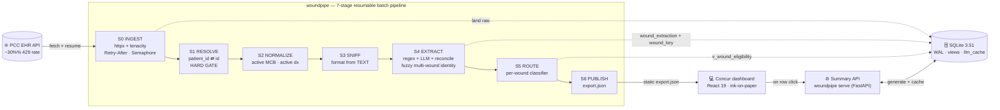
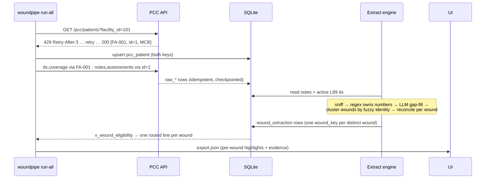
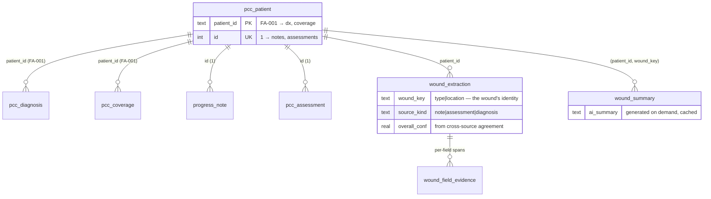

<div align="center">

# 🩹 Concur

### Wound-Care Medicare Part B Billing Review

**Pull messy EHR data through a 30%-failure API → extract wound clinical facts from four note formats → split each chart into one billable line *per wound* and route every line `Ready to bill` / `Needs your review` / `Not billable` with a plain-English reason — so a non-technical biller sees exactly what to act on, and why.**

Concur is the billing-review dashboard; **`woundpipe`** is the pipeline + CLI that feeds it.

      

</div>

---

## ✨ Why this exists

Post-acute wound care is the **highest-denial documentation problem in SNF billing** — denial rates run 25–35%, and the cause is almost never the code, it's a **missing measurement** invisible until the claim bounces. A biller manually opens hundreds of charts in PointClickCare, reads four inconsistent note formats, cross-checks coverage and diagnoses, and guesses what's billable. A single chart often documents **several wounds**, each separately billable.

Concur automates the data collection and triage so the biller sees, at a glance, one row **per wound**:

> **`Agnes Dunbar · FA-001` — `Needs your review` — Depth not documented; confirm before billing.**

…and can click a row to read an **AI summary generated on the spot**, see the **original note with the extracted fields highlighted in place**, and **Approve** or **Send back** that wound.

The guiding principle: **flag, don't hallucinate.** We would rather route an ambiguous wound to a human than invent a depth measurement that turns into a denied claim. **Nothing is ever billed automatically** — every line waits for a person.

---

## 🏛️ Architecture



The batch pipeline writes a **static `export.json`** (the worklist). AI summaries are **not** pre-baked — the dashboard calls the small **`woundpipe serve`** API on row-click to generate one wound's summary lazily and cache it.

### Data flow for one wound



### Data model — patient → many wounds → many sources



> **`v_wound_eligibility`** and **`v_wkey_corroboration`** are SQL **views** — routing is a *live per-wound query*, never a stale dump. `v_patient_eligibility` is kept as the patient-level rollup.

---

## 🔬 How it works

| Concern | Approach |
|---|---|
| **~30% 429 API** | `httpx` + `tenacity`: honor `Retry-After` on 429, exp+jitter on 5xx/timeout, **422 fail-fast**; bounded `Semaphore` with the permit **held across retry sleeps** (anti-storm); every call checkpointed in `fetch_log` → a crash mid-run resumes only the remaining calls. |
| **Two patient IDs** | `patient_id` (`FA-001`) keys diagnoses/coverage; integer `id` keys notes/assessments. Resolved once in a **hard gate** before fan-out — wrong-key 422s are structurally impossible. |
| **4 messy note formats** | Format detected from the **text**, not the (misleading) `note_type`. **Regex owns measurements** (returns a literal substring or null — never invents a number); an optional **Claude lane** gap-fills only the fields regex left null, behind a **verbatim-span gate** that drops any hallucinated measurement. |
| **Many wounds per chart** | A note may document several wounds. The engine extracts each, then clusters them into **distinct billable wounds** by a **fuzzy identity** (normalized `wound_type` + location, `difflib` similarity ≥ 0.85 / prefix). Garbled or unknown-type variants ("Rightlowerle" vs "Right lower leg") **merge**; genuinely different sites/types stay separate — killing both the dropped-wound and false-conflict bugs. |
| **Trust / confidence** | Not the LLM's self-report. Confidence = **cross-source agreement** *per wound*: when the ICD-10 diagnosis, the note, and the assessment describe the same wound, confidence is high. Surfaced to billers as plain **Strong / Moderate / Weak match**. |
| **The decision** | A glass-box **selective classifier** evaluated **per wound**: `auto_accept` only when complete **and** corroborated by ≥2 sources; everything ambiguous routes to a wide `flag` region; `reject` for not-MCB / no-wound. Realized as the `v_wound_eligibility` SQL view (a Python oracle asserts equivalence in CI). |
| **AI summary, on demand** | Plain-English, biller-facing summary generated **only when a row is opened** by the `woundpipe serve` API (Claude when keyed, deterministic template otherwise), cached in `wound_summary`. No upfront batch cost. |
| **Schema management** | Versioned `migrations/NNN_*.{up,down}.sql` + a `PRAGMA user_version` runner, expand/contract discipline, and a tested up→down→up rollback. |

---

## 🚀 Quickstart

```bash
# 1. install
python -m venv .venv && source .venv/bin/activate
pip install -e .                      # add ".[llm]" for the optional Claude lane

# 2. run the batch pipeline against the live API (resilient + resumable)
woundpipe run-all --db data/woundpipe.db
#   init-db → ingest (≈1,200 calls through the 429 storm) → extract → route → publish
#   (AI summaries are NOT pre-generated here — they're created on demand, see step 3)

# 3. start the dashboard — TWO processes:
woundpipe serve --db data/woundpipe.db         # summary API on :8787
cd frontend && npm install && npm run dev       # Vite proxies /api → :8787
```

Individual stages are independently re-runnable (and resume):

```bash
woundpipe init-db
woundpipe ingest --facilities 101,102,103        # add --since <ISO> for incremental
woundpipe extract                                 # regex + optional LLM + fuzzy wound identity
woundpipe route                                   # prints the routing distribution
woundpipe publish --out data/export.json
woundpipe summarize                               # OPTIONAL: pre-warm the summary cache
```

> No `ANTHROPIC_API_KEY`? The **deterministic regex lane is the floor** — the pipeline runs and routes everything without an LLM, and `serve` falls back to a deterministic summary template. The Claude lane is pure upside.

---

## 🖥️ The Concur dashboard

A Vite + React 19 + Tailwind v4 SPA — **refined ink-on-paper** (Hanken Grotesk + Geist Mono, warm-paper canvas, hairline borders), built for non-technical billing staff:

- **Claims to review** *(default)* — a TanStack worklist with **one row per billable wound** (a patient with 3 wounds shows 3 rows). Plain status (`Ready to bill` / `Needs your review` / `Not billable`), match-strength in words, instant search/filter, and **Approve / Send back per line** (saved in the browser, survives refresh).
- **Overview** — plain counts: needs review · ready to bill · not billable · decided by you.
- **Wound detail** *(on row click)* — an **AI summary generated on demand**, the plain billing requirements, the **original note with matched fields highlighted in place**, a switcher for the patient's other wounds, and the Approve / Send-back action.
- **Admin** — the technical dashboards (live pipeline graph, payer→route Sankey, eligibility funnel, 429 retries) tucked away from the biller worklist.

---

## 🗂️ Project structure

```
src/woundpipe/
  config.py  errors.py  logging.py  models.py      # shared contracts
  db/        engine.py  migrate.py                  # WAL + user_version runner
  ingest/    client.py  fetch.py  checkpoint.py     # resilient fetch + resume
  resolve/   identity.py                            # two-identity hard gate
  extract/   sniff.py regex_lane.py llm_lane.py reconcile.py engine.py   # + fuzzy wound identity
  route/     eligibility.py                          # SQL-view execution + Python oracle
  publish/   export.py                               # export.json (patients[].wounds[])
  summarize.py                                        # per-wound summaries (LLM / deterministic)
  api.py                                              # FastAPI: on-demand /api/summary
  cli.py                                              # init-db|ingest|extract|route|summarize|publish|run-all|serve
migrations/  001_initial … 003_fetch_health  004_extract_state  005_llm_cache  006_ai_summary  007_multi_wound
frontend/    React 19 + Vite + Tailwind v4 (ink-on-paper)
  src/data/  useExport.ts (claim lines) · useDecisions.ts (localStorage) · useWoundSummary.ts (lazy fetch)
  src/screens/ TriageTable (Review Queue) · PatientDetail · Overview · Admin
tests/       extraction (+ multi-wound, fuzzy cluster) · routing oracle · view↔oracle · summarize · api
```

---

## ✅ Testing

```bash
pytest -q          # 24 tests: extraction · fuzzy clustering · routing oracle · SQL-view↔oracle · summary API
```

Acceptance highlights enforced: resilient/resumable ingest, **no fabricated measurements** (every numeric is a literal substring of its source), a two-wound note yields two independently-routed lines, fuzzy identity merges garbled duplicates but keeps distinct wounds apart, every routed line has a non-empty reason, the SQL routing view agrees with the Python oracle, and `/api/summary` generates-then-caches.

---

## 🔭 From hackathon to MVP

Built as an MVP, not a throwaway: schema-managed, idempotent, resumable, observable. Roadmap: advance the `sync_state` watermark for true incremental `--since` sync, per-wound ICD-10 dx-site matching, host the summary API for production (it's local/dev today), and human-in-the-loop threshold calibration on a labeled gold set. See [`.agency/artifacts/MASTER-BLUEPRINT.md`](.agency/artifacts/MASTER-BLUEPRINT.md) and [`.agency/artifacts/SPEC.md`](.agency/artifacts/SPEC.md).

> **Compliance:** synthetic data only, no PHI. HIPAA-ready by design — no PHI in logs, least-privilege, an audit trail per decision.

---

<div align="center">
<sub>Concur · powered by the <code>woundpipe</code> pipeline · every load-bearing claim verified, not asserted.</sub>
</div>
